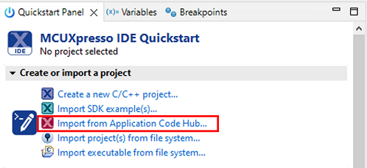
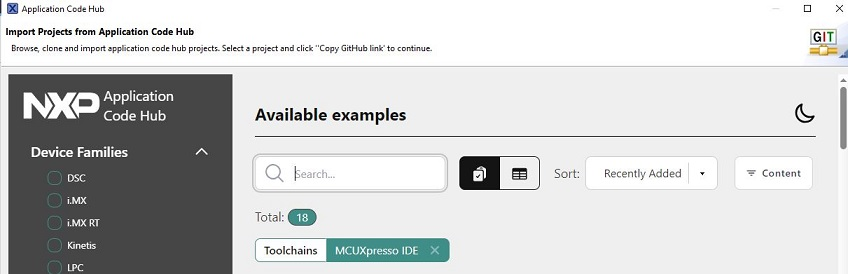
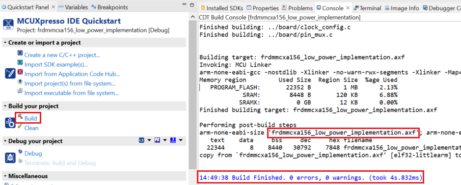
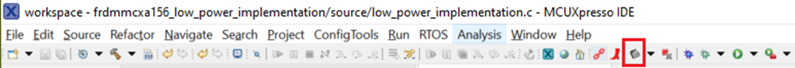
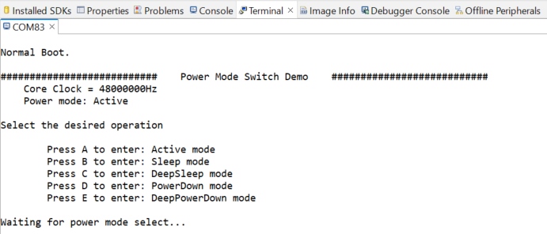
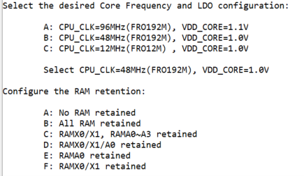
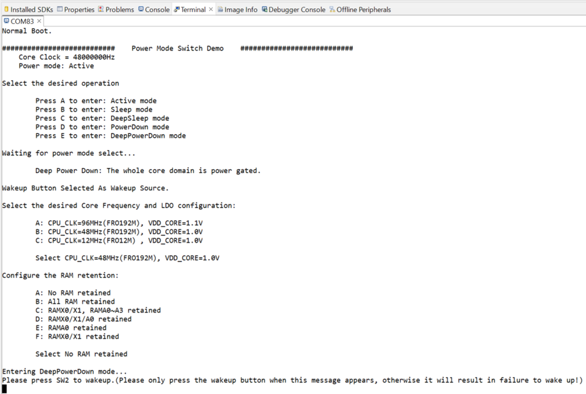
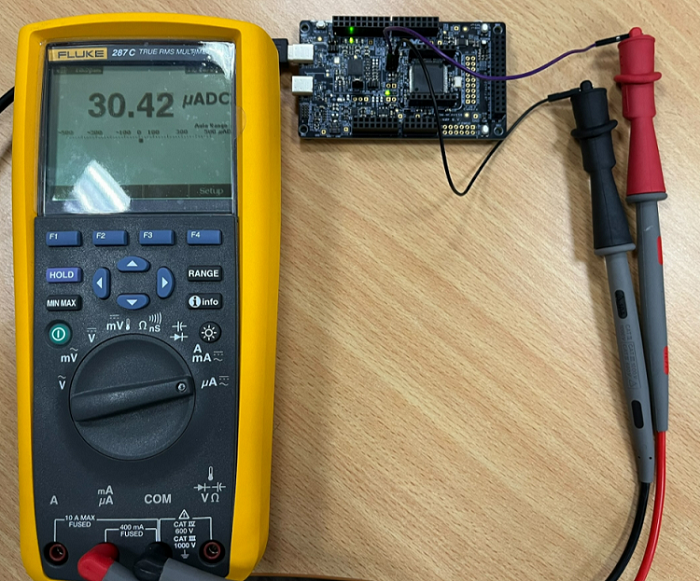
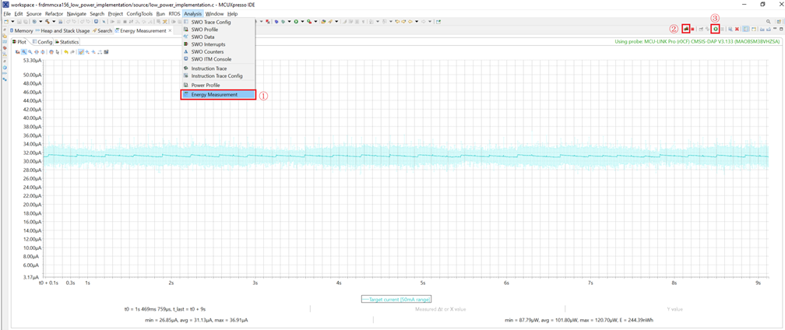
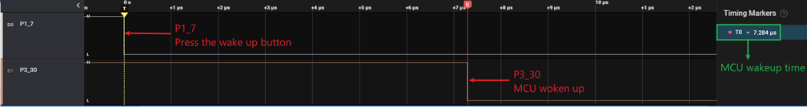

# NXP Application Code Hub

## AN14447: How to implement low power on MCXA156

The low power implementation demo provides different user interfaces to facilitate users to measure different power consumption and corresponding wake-up time.

#### Boards: FRDM-MCXA156
#### Categories: Low Power
#### Toolchains: MCUXpresso IDE

## Table of Contents
1. [Software](#step1)
2. [Hardware](#step2)
3. [Setup](#step3)
4. [Results](#step4)
5. [FAQs](#step5) 
6. [Support](#step6)
7. [Release Notes](#step7)

## 1. Software
- [MCUXpresso IDE V11.9.0 or later](https://www.nxp.com/design/software/development-software/mcuxpresso-software-and-tools-/mcuxpresso-integrated-development-environment-ide:MCUXpresso-IDE)
- [SDK_2.16.0_FRDM-MCXA156](https://mcuxpresso.nxp.com/en/welcome)
- MCUXpresso for Visual Studio Code: This example supports MCUXpresso for Visual Studio Code, for more information about how to use Visual Studio Code please refer [here](https://www.nxp.com/design/training/getting-started-with-mcuxpresso-for-visual-studio-code:TIP-GETTING-STARTED-WITH-MCUXPRESSO-FOR-VS-CODE).

## 2. Hardware
- FRDM-MCXA156 board:

- One Type-C USB cable.

> If you want to measure power consumption, prepare [MCU-Link Pro](https://www.nxp.com/design/design-center/software/development-software/mcuxpresso-software-and-tools-/mcu-link-pro-debug-probe:MCU-LINK-PRO) or Multimeter.

>If you want to measure wake-up time, **rework the FRDM-MCXA156 to connect SW2-4 to J1-1** and prepare an oscilloscope or logic analyzer.

## 3. Setup

### 3.1 Hardware connection
- Use a Type-C USB cable to connect J21 of FRDM-MCXA156 and the USB port of the PC.

### 3.2 Import Project
1. Open MCUXpresso IDE 11.9.0, in the Quick Start Panel, choose **Import from Application Code Hub**

2. Enter the **demo name** in the search bar.

3. Click **Copy GitHub link**, MCUXpresso IDE will automatically retrieve project attributes, then click **Next>**.

4. Select **main** branch and then click **Next>**, select the MCUXpresso project, click **Finish** button to complete import.

> You need to install the [SDK_2.16.0_FRDM-MCXA156](https://mcuxpresso.nxp.com/en/welcome) on your MCUXpresso IDE.

### 3.3 Build and Flash Project
- Click **Build** button from the toolbar, then wait for the build to complete.

- Select the **GUI Flash Tool** from the toolbar to program the executable to the board.

### 3.4 Select low power mode and corresponding configurations
1. Open a serial terminal with a 115200 baud rate.
2. Follow the prompts and enter one from A to E to enter different low power mode.

3. Different low power modes will provide different configurations, and you need to select the corresponding configuration according to the prompts. The following screenshot shows the configurations provided in Deep Power Down mode.

4. The following screenshot shows the entire configuration process, and press SW2 on FRDM-MCXA156 to wake up the MCU. 
 
  **Please only press the wakeup button when prompt message appears, otherwise it will result in failure to wake up!**

 

### 3.5 Measure power consumption
- Use an multimeter to measure the current at JP2 of the FRDM-MCXA156 board.

- Use MCU-Link Pro and MCUXpresso IDE to measure power consumption:
  - Configure the MCU-Link Pro current measurement range from 350mA to 50mA by changing the 3 jumpers J16/J17/J18 to short pins 2-3.
  - Connect MCU-Link Pro board to FRDM-MCXA156 board.

  |MCU-Link Pro|FRDM-MCXA156|
  |--|--|
  |J9-1|JP2-1|
  |J9-3|JP2-2|
  |J9-2|J3-14|

  - Follow the below steps to measure current with MCUXpresso IDE.

  

### 3.6 Measure wake-up time
- Get the wake-up time by measuring the delay between the falling edges of J1-1 (P1_7) and J6-1 (P3_30) using logic analyzer or oscilloscope.

## 4. Results
The following power consumption and wake-up time are provided as a reference.

>Different samples, temperature, and measuring instruments affect test results.

>Before measuring each data, POR is recommended.

>This demo is not configured exactly the same as the data sheet, so the test data may be slightly different.

>Refer to “Power mode transition operating behaviors” table in MCXA156 data sheet that lists wake-up time, and “Power consumption operating behaviors” section in MCXA156 data sheet that describes different power consumption data.

|Power mode|Description|Tested power consumption|Power consumption in data sheet|Tested wake-up time|Wake-up time in data sheet|
|--|--|--|--|--| -- |
|Sleep|VDD_CORE=1.1V CPU_CLK=96MHz|3.429mA|3.34mA|0.15us|N/A|
|Sleep|VDD_CORE=1.0V CPU_CLK=48MHz|1.804mA|1.81mA|0.27us|0.23us|
|Sleep|VDD_CORE=1.0V CPU_CLK=12MHz|0.446mA|0.43mA|1.086us|N/A|
|DeepSleep|VDD_CORE=1.1V CPU_CLK=96MHz FRO12M disabled|256.27uA|257.98uA|6.552us|N/A|
|DeepSleep|VDD_CORE=1.0V CPU_CLK=48MHz FRO12M disabled|31.07uA|32.26uA|7.284us|7.1us|
|DeepSleep|VDD_CORE=1.0V CPU_CLK=48MHz FRO12M enabled|107.13uA|104.53uA|7.281us|N/A|
|DeepSleep|VDD_CORE=1.0V CPU_CLK=12MHz FRO12M disabled|31.02uA|N/A|14.274us|N/A|
|PowerDown|VDD_CORE=1.1V CPU_CLK=96MHz All RAM retained|254.37uA|N/A|7.514us|N/A|
|PowerDown|VDD_CORE=retention voltage CPU_CLK=48MHz All RAM retained|10.58uA|9.47uA|16.848us|16.6us|
|PowerDown|VDD_CORE=retention voltage CPU_CLK=48MHz RAM X0/X1 and RAM A0 retained|9.28uA|8.20uA|16.848us|N/A|
|PowerDown|VDD_CORE=retention voltage CPU_CLK=12MHz All RAM retained|10.53uA|N/A|23.758us|N/A|
|DeepPowerDown|VDD_CORE=1.0V CPU_CLK=48MHz All RAM OFF FRO16K enabled|0.65uA|0.60uA|1.44ms|1.44ms|
|DeepPowerDown|VDD_CORE=1.0V CPU_CLK=48MHz All RAM retained FRO16K enabled|2.37uA|2.19uA|1.44ms|N/A|
|DeepPowerDown|VDD_CORE=1.0V CPU_CLK=48MHz RAM X0/X1 and A0-A3 retained FRO16K enabled|1.71uA|1.57uA|1.44ms|N/A|
|DeepPowerDown|VDD_CORE=1.0V CPU_CLK=48MHz RAM X0/X1 and A0 retained FRO16K enabled|1.02uA|0.93uA|1.44ms|N/A|
|DeepPowerDown|VDD_CORE=1.0V CPU_CLK=48MHz RAM A0 retained FRO16K enabled|0.87uA|0.79uA|1.44ms|N/A|
|DeepPowerDown|VDD_CORE=1.0V CPU_CLK=48MHz RAM X0/X1 retained FRO16K enabled|0.90uA|0.82uA|1.44ms|N/A|

## 5. FAQs
*No FAQs have been identified for this project.*

## 6. Support
*Please contact NXP for additional support.*

#### Project Metadata

<!----- Boards ----->

<!----- Categories ----->

<!----- Peripherals ----->

<!----- Toolchains ----->

Questions regarding the content/correctness of this example can be entered as Issues within this GitHub repository.

>**Warning**: For more general technical questions regarding NXP Microcontrollers and the difference in expected functionality, enter your questions on the [NXP Community Forum](https://community.nxp.com/)

## 7. Release Notes
| Version | Description / Update                           | Date                        |
|:-------:|------------------------------------------------|----------------------------:|
| 1.0     | Initial release on Application Code Hub        | September 2nd 2024 |